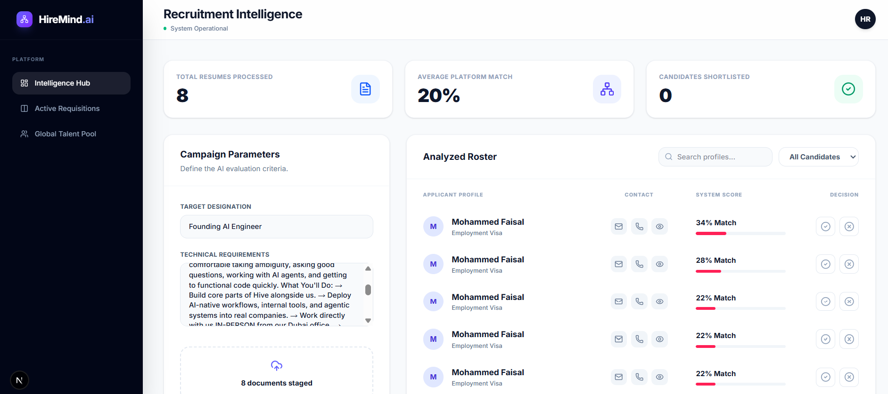

# 🧠 HireMind.ai



**AI-Powered Hiring Intelligence Engineered for UAE Enterprises.**

HireMind is a production-ready Applicant Tracking System (ATS) that leverages local, open-source Machine Learning models to semantically screen, rank, and evaluate talent pipelines without relying on paid external APIs.

## 🚀 Enterprise Features
*   **Semantic Vector Matching:** Replaces keyword-matching with deep semantic understanding using `SentenceTransformers` and `FAISS` to calculate true candidate-to-JD alignment.
*   **Zero-Shot Risk Classification:** Utilizes `facebook/bart-large-mnli` to automatically flag operational risks (like job hopping or skill mismatch) and identify core leadership strengths.
*   **UAE Localization Engine:** Hardcoded logic to detect and prioritize Emiratization quotas, alongside visa category extraction (Golden Visa, Employment, etc.).
*   **Dynamic Candidate Roster:** Interactive Kanban boards, global talent pool searching, and deep-dive AI assessment modals.
*   **Data Privacy:** Models run directly on the server. Zero candidate data is transmitted to third-party LLM providers.

## ⚙️ Core Architecture
**Frontend (Vercel)**
*   Next.js 14 (App Router)
*   React & TypeScript
*   TailwindCSS & ShadCN UI Design System
*   Lucide Icons

**AI Engine & Backend (Render)**
*   FastAPI & Python 3
*   `sentence-transformers` (paraphrase-multilingual-MiniLM-L12-v2)
*   `transformers` (Zero-Shot Classification pipeline)
*   `faiss-cpu` (High-speed vector similarity search)
*   `pypdf` (Document text extraction)

## 💻 Local Development Setup

### 1. Start the AI Engine (Backend)
```bash
cd backend
python -m venv venv
source venv/bin/activate  # Windows: .\venv\Scripts\activate
pip install -r requirements.txt
uvicorn app.main:app --host 0.0.0.0 --port 8000 --reload